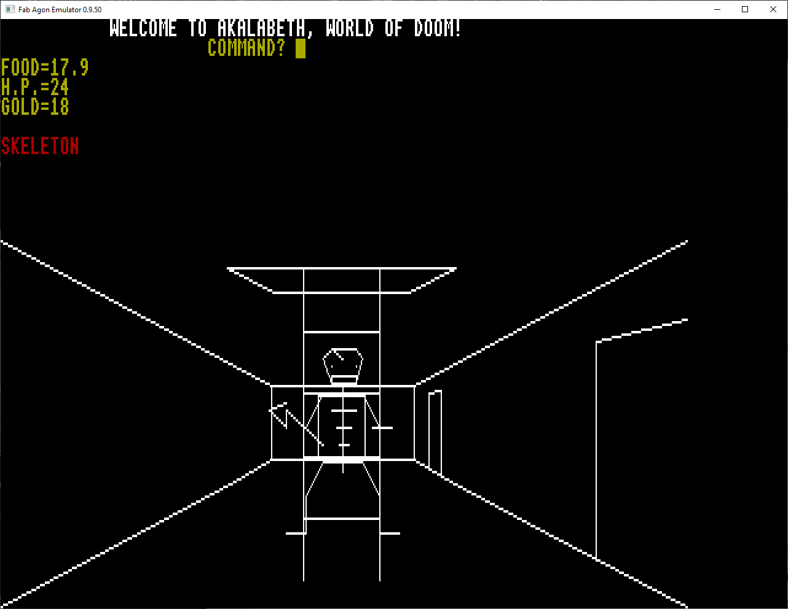

# Akalabeth
Akalabeth: World of Doom

## History
This game has the proud history of being the predecessor to the Ultima series of games. It has been packaged as Ultima 0. There's a lot out on the web about this game, which I will summarise here at a later date. You can find the original 1979 program along with some commentary and screenshotsat on the [Video Game Preservation github](https://github.com/videogamepreservation/akalabeth). It talks about perhaps someone will want to make a PC version, which was in face done by Nanochess a year earlier. You can read the story of that conversion, which was my starting point, [here](https://nanochess.org/akalabeth.html).

## This Project
Instead of using the original Apple II version, I started with Nanochess's GW-BASIC port. This made an easier port to BBC BASIC 3 on the Agon Light. There are some changes to screen layout and control keys in the main game, however, the rest is largely untouched other than the changes needed to convert the version of BASIC as well as the platform. On top of Nanochess' changes, these are the changes I needed to make (this will get expanded out over time):
<li>I can't find an equivalent of RANDOMIZE so the Lucky Number input does nothing.</li>
<li>LOCATE commands are replaced by PRINT TAB(x,y)</li>
<li>SCREEN commands deleted except for the one replaced to set the initial screen mode with VDU commands</li>
<li>LINE INPUT becomes INPUT LINE</li>
<li>There is no equivalent of the centisecond timer. I've substituted INKEY$(nnn) routines that work in the circumstances.</li>
<li>INPUT$(1) becomes GET$</li>
<li>LINE routines have been replaced with scaled VDU routines</li>
<li>CY=CSRLIN:CX=POS(0) becomes CY=VPOS:CX=POS</li>
<li>All integer printing e.g. PRINT X needed to be replaced with PRINT STR$(X) to prevent leading spaces</li>
<li>All variables that are tested before they are assigned needed to be initialised. e.g. you can't say IF NN=0 THEN NN=1 if you have not assigned a value to NN yet</li>
<li>MID$ seems to be off by 1 compared to GW BASIC</li>
<li>PSET is also replaces by VDU commands</li>

## Status
So far it seems to mostly work as expected, so I'm sharing it. I expect there will be some bugs, and of course it could be improved with more colour and the addition of sound, but that would be a different game.

## Gameplay and Instruction
You'll want a copy of the original manual to understand the terrain. There are a number of different game manuals around, including the versions on the (Internet Archive/Museaum of Computer Adventure Game History)[https://archive.org/details/vgmuseum_origin_akalabeth-manual/mode/2up] along with an (even older version on the MoCAGH)[https://www.mocagh.org/origin/akalabethcomputerland-manual.pdf]. The changed keys are explained in the game itself (I've added some extra code to show what keys do what). 

Screenshot from the game:

